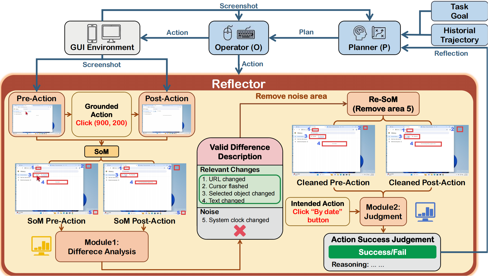

# Reflection with Action-Induced Visual Differences for Desktop GUI Agents

Desktop GUI agents rely on vision-language models to execute user instructions through human-like interface operations such as clicking, typing, and scrolling. In Planner-Operator-Reflector (POR) style systems, the reflector is a critical safeguard: it compares the screenshots before and after an action to verify whether the action actually advanced the task. This step is especially difficult on desktop interfaces, where large screens, dense layouts, subtle cursor movements, and distributed page changes make reliable reflection challenging.

This repository provides **Evidence-First Reflection (EFR)**, a two-stage reflector for desktop GUI agents. Instead of asking a model to identify visual changes and judge action success in one step, EFR first uses Set-of-Marks style annotations to expose action-induced change regions and the grounded action location, then describes and filters action-relevant visual evidence. The final success judgment is made only after this evidence extraction stage, grounding reflection in explicit screen-transition evidence and improving robustness under subtle or cluttered visual changes.

The implementation follows a Mobile-Agent-v3-style POR pipeline for OSWorld-compatible desktop environments: a manager tracks high-level progress, an executor predicts the next GUI action, an optional grounding module resolves screen coordinates, and the EFR reflector verifies the action outcome from before/after screenshots. The pipeline is shown below.



## Requirements

Environment setup follows **OSWorld**. Before running this project, make sure you can create and control an OSWorld desktop environment on your machine.

Recommended requirements:

- Python >= 3.10
- Conda or another Python environment manager
- Docker, VMware, VirtualBox, or another OSWorld-supported VM provider
- An OpenAI-compatible multimodal model endpoint, or DashScope

The default entry point uses OSWorld's Docker-backed Ubuntu desktop provider. For Docker, KVM, VM image, account, and proxy setup, follow the official OSWorld documentation and the included provider guide:

```text
desktop_env/providers/docker/DOCKER_GUIDELINE.md
```

## Python Environment

We recommend using Conda to manage your Python environment:

```bash
conda create -n osworld python=3.10
conda activate osworld
pip install -r requirements.txt
```

## OSWorld Environment

This repository includes the `desktop_env` package needed by the runner. The environment is created through OSWorld's provider interface.

By default, `run_efr.py` uses:

- `--provider_name docker`
- `--observation_type screenshot`
- `--screen_width 1920`
- `--screen_height 1080`

If you want to use another OSWorld provider, pass the provider name and VM path explicitly:

```bash
python run_efr.py \
  --provider_name vmware \
  --path_to_vm /path/to/Ubuntu.vmx \
  --instruction "Open Files and create a folder named demo."
```

## LLM Configuration

### OpenAI-Compatible Endpoint

The default engine is `openai`. It calls an OpenAI-compatible `chat.completions.create(...)` API, so it can work with local servers such as vLLM or compatible hosted services.

You can pass the endpoint in the command line:

```bash
python run_efr.py \
  --api_url http://127.0.0.1:8000/v1 \
  --api_key EMPTY \
  --model gui-owl \
  --instruction "Open the terminal and print the current date."
```

Or configure it in `.env`:

```bash
OPENAI_API_KEY=EMPTY
OPENAI_BASE_URL=http://127.0.0.1:8000/v1
```

### DashScope

To use DashScope, set `DASHSCOPE_API_KEY` and run with:

```bash
python run_efr.py --engine dash --model your-dashscope-model --instruction "..."
```

## Example Usage

The following command runs EFR on one natural-language desktop task with a local OpenAI-compatible model server:

```bash
python run_efr.py \
  --instruction "Open the system settings and switch the appearance to dark mode." \
  --api_url http://127.0.0.1:8000/v1 \
  --api_key EMPTY \
  --model gui-owl \
  --result_dir results \
  --max_steps 50 \
  --max_trajectory_length 50
```

## Outputs

The run outputs are saved under `--result_dir`.

Main logs:

- `global_state.json`: the latest full agent state, including prompts, responses, and intermediate reflector data.
- `traj.jsonl`: step-level execution records, including action, status, reward, and done flag.

Screenshots and recordings may also be saved when supported by the OSWorld environment.

## Notes

- Follow OSWorld for desktop environment setup and provider troubleshooting.
- Make sure Docker or your selected VM provider is available before running the agent.

## Acknowledgements

This project reuses and adapts components from:

- [OSWorld](https://github.com/xlang-ai/OSWorld)
- [Mobile-Agent]([X-PLUG/MobileAgent: Mobile-Agent: The Powerful GUI Agent Family](https://github.com/X-PLUG/MobileAgent))

## License

Apache-2.0. Keep upstream notices when publishing modifications based on OSWorld or related agent implementations.
